# Kafka

## What is the Kafka?
It is open-source distributed event streaming platform
Creating or generating real-time stream data
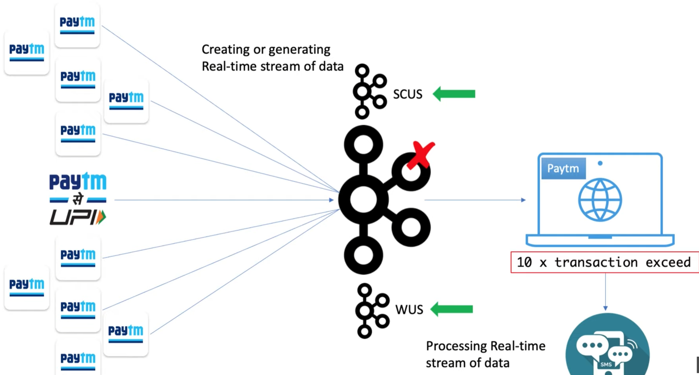
## Why do you need Kafka?

## How does it work?
- Pub/Sub Model (publish/ subscribe)
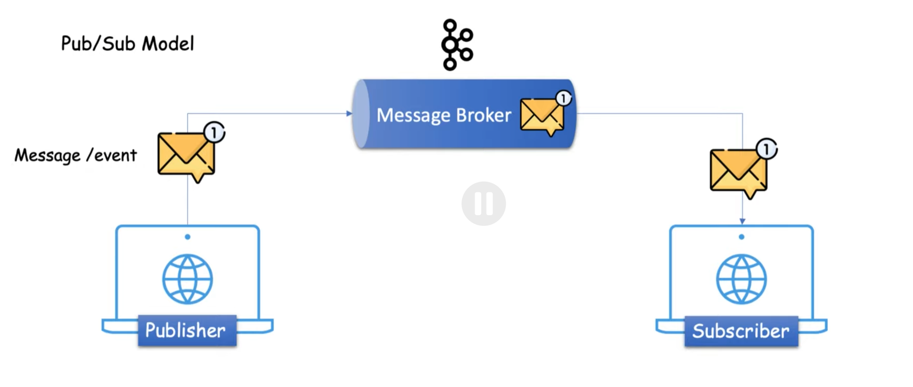
---
## Kafka Architecture & Components
### Producer
is the source of data who will publish the messages or events.
---
### Consumer
act as a receiver. It is responsible for receiving or consuming messages or events.  
However, they will not directly communicate with each other.
---
### Broker or Server
To process the messages/ events from Producer to Consumer. It is middleman between them.  
The Kafka Broker is nothing but just a server. In other word/ simple word, A Broker is just an intermediate entity that heps in message exchange between a Producer and a Consumer.
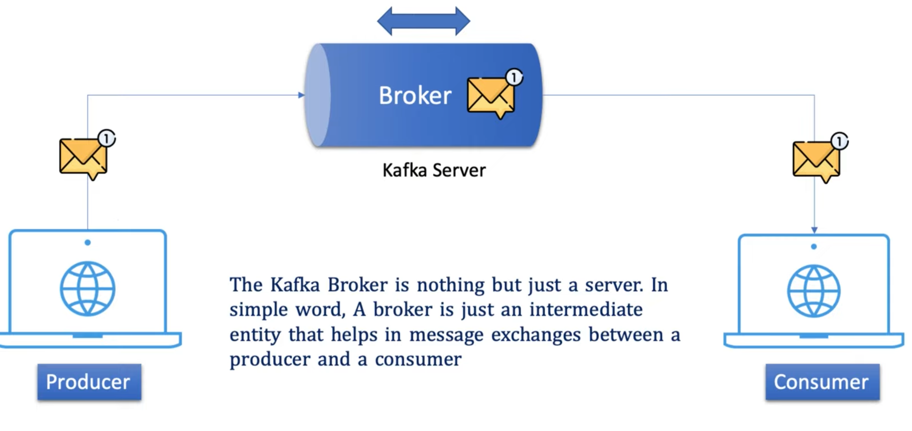
---
### Cluster
just a group of computers or servers.  
Kafka is also a distributed system => It can have multiple Kafka Broker/ Server.
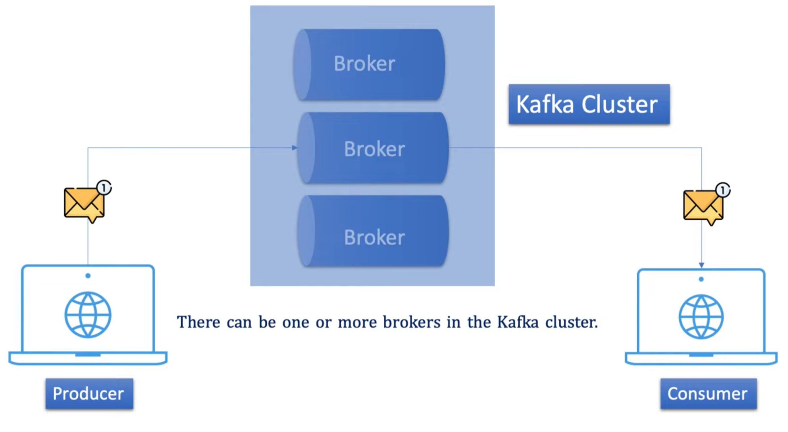
---
### Topic
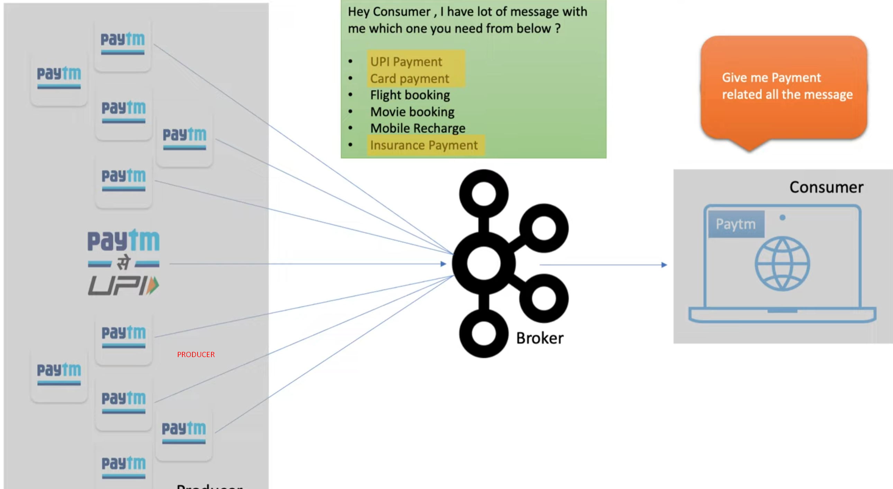
to categorize different type of messages/ events  
=> simple create multiple topic to store different type of messages/ events (can rename topics)
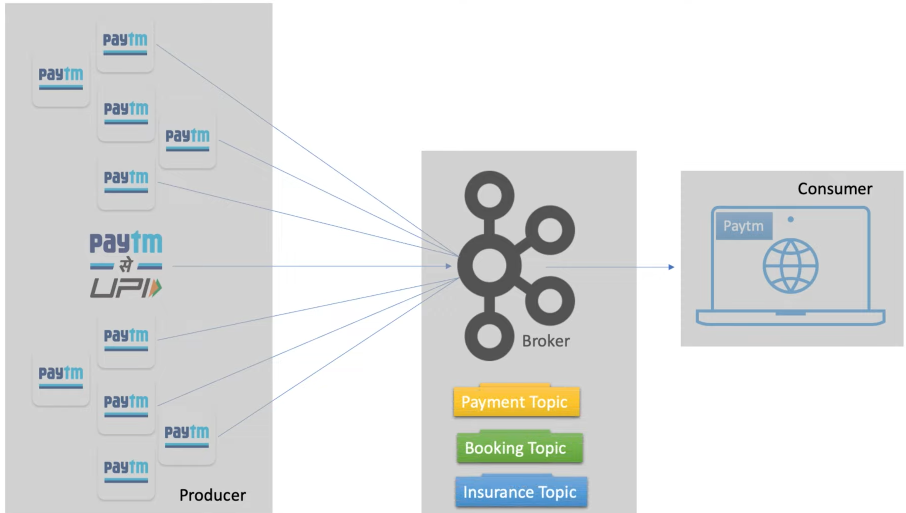
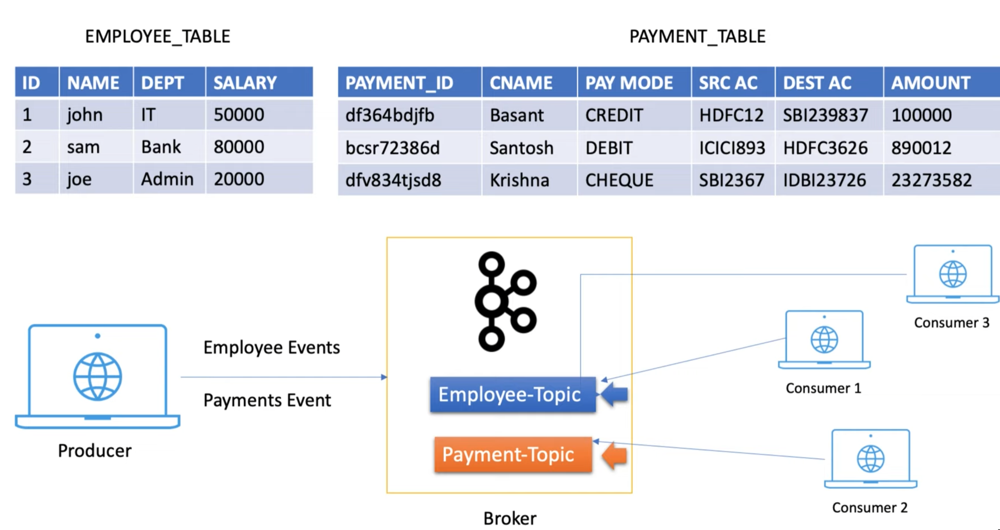
=> It specifies the category of the messages/ events or the classification of the message. Listeners can then just respond/ subscribe to the messages that belong to the topics that they are listening on.
### Partitions
Example: Payment Producer sends data to the Broker and the broker store the messages inside a topic. 
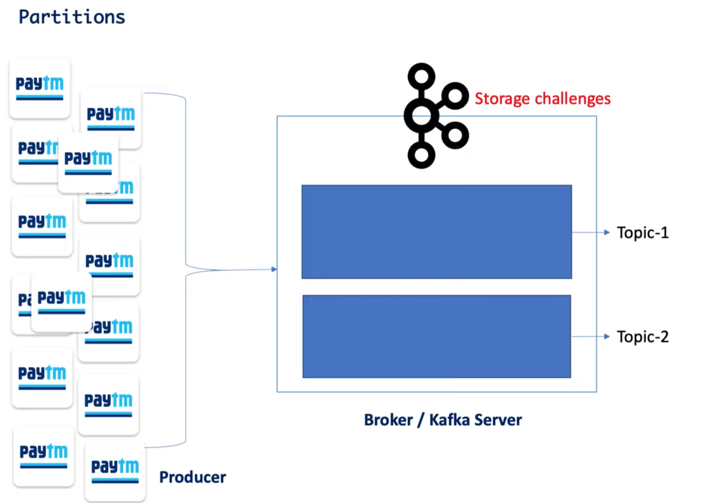
Assume you have a huge volume of data (Your producer is publishing millions or billions messages per seconds to the topic).  
= > Storage challenging   
However, the messages are inside the topic stored on a single machine. How can I handle this situation?  
= > We can break the Kafka Topics into multiple parts and distribute those parts into different machines  
= > Topic Partitioning, each part is called Partition in Kafka  
= > give you better performance and high availability because when producer publish bulk messages then each partitions concurrently accepts the messengers/ events
that will definitely improve the performance.  
In case if any partition goes off then other partitions are available to handle the loads without any application downtime.
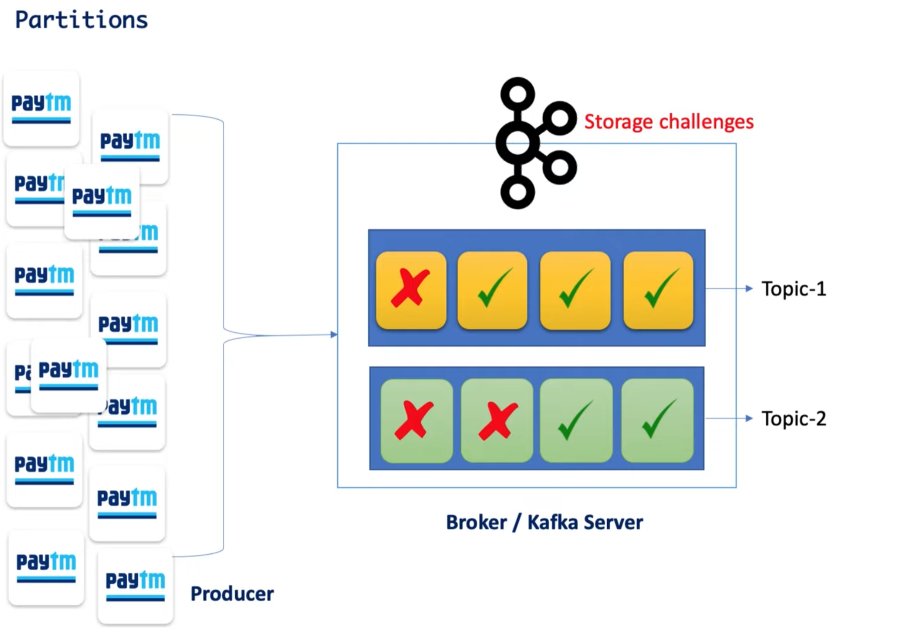
### Offset
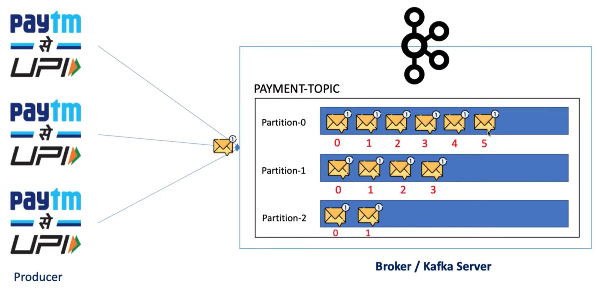
In kafka, a sequence number is assigned to each messages in each partition of a Kafka topic. This sequence number is called Offset.  
The purpose of Offset is to keep it track of which messages have already been consumed by the Consumer.
Round Robin principle

Let's consider after reading four messages from the partition, Consumer went down and then when Consumer will back to the online status  
= > Offset value would help it to know that exactly from where the Consumer has to start consuming the messages.
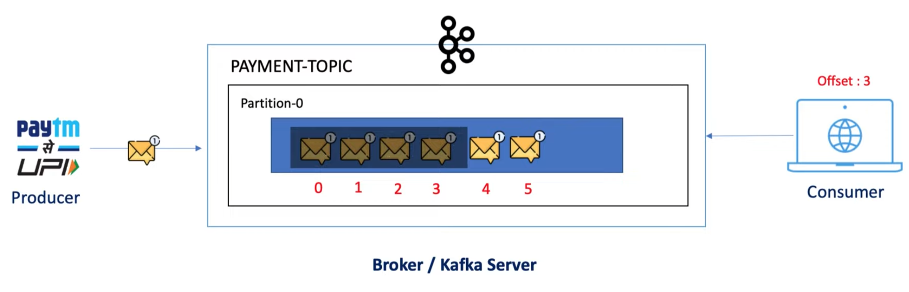
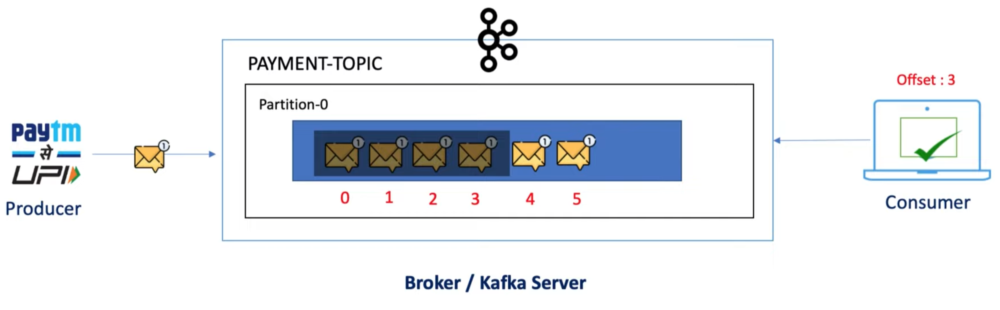
Now, if you observe Consumers should start reading from offset 4 instead from the 0 again  
= > Key role of offset
### Consumer Groups
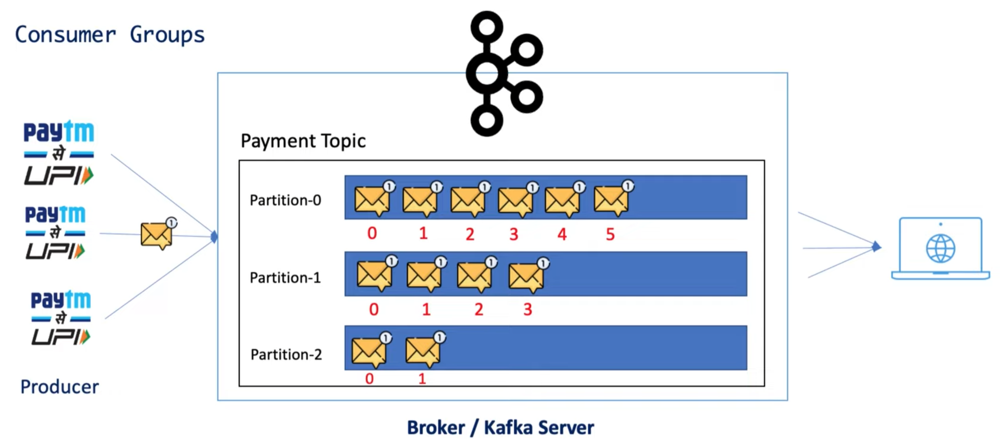
In this example, there are 3 partitions inside Payment topic, but just only a single consumer is reading from each and every partition which will definitely leads the performance issue.  
Because there is no concurrency.  
  
= > Share workload = > Define n number of consumer instance  
Group all the three consumer what I define into a single unit by specifying the group name  
=> Consumer Group
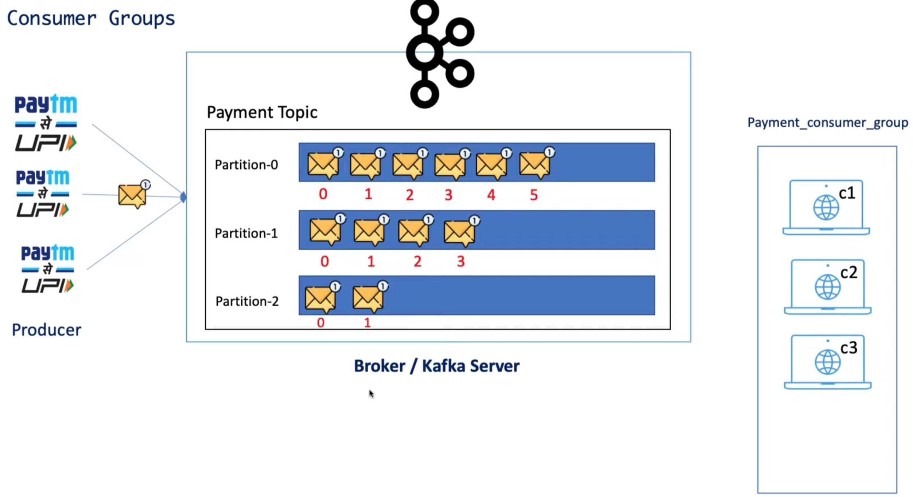
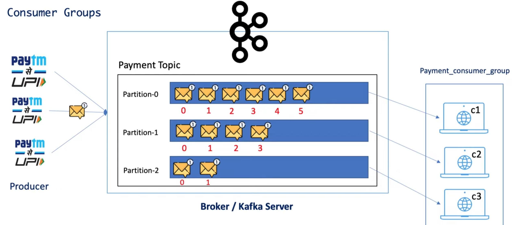
if there are four consumer instance => Consumer Rebalancing
### Zookeeper
Zookeeper is a prerequisite for Kafka. Kafka is a distributed system, and it uses Zookeeper for coordination and to track the status of Kafka cluster nodes. It also keeps track of Kafka topics, partitions, offsets, ...etc.  
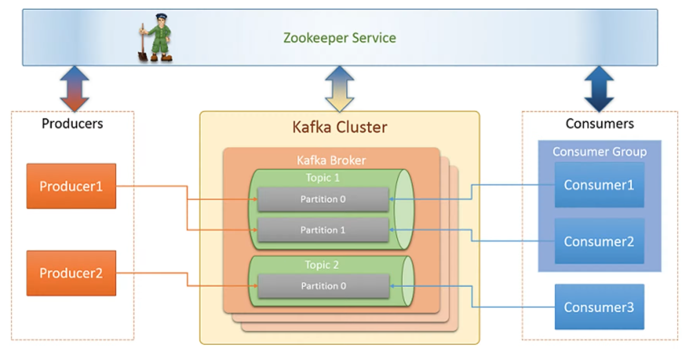   
#### Các phương pháp cài đặt
##### Trên Windows
##### Sử dụng docker-compose
## Kafka Error Handling
---
### Use case
Gỉa sử bạn đang xử lý giao dịch tài chính, xử lý giao dịch bị lỗi vì một số vấn đề tạm thời xảy ra (Kafka vẫn chạy chứ không bị down)  
=> Vậy phải xử lý chúng như thế nào  
=> Ensure reliable message processing  
=> Cần phải chỉ dẫn Kafka retry the failed event
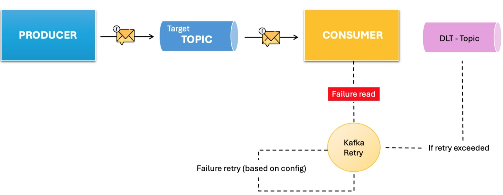  
### What is the DLQ - DLT (Dead letter queue/ topic)
Lưu trữ tất cả message/ event bị xử lý thất bại sau khi đã retry
Đảm bảo dữ liệu không bị mất